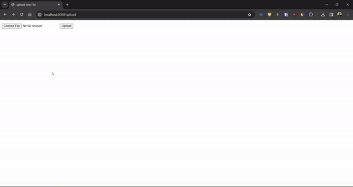

# Flask on Docker

## Overview

This repository contains a simple Flask web application that runs inside Docker containers. This project is designed to showcase a more complicated "hello world" application that integrates Flask with Postgres for the database, Gunicorn as the WSGI for running the application, and Nginx for serving static files and acting as a reverse proxy. This setup mimics a production-ready environment, demonstrating the use of Docker to containerize and manage the components of a web application.



For the purpose of demonstration, a short animated gif showing the process of uploading an image through the application's interface is included.

## Build Instructions

To get this application up and running, follow these steps:

1. **Fork the repository:**

   Click on the "Fork" button above to create a copy of the repository in your own GitHub account.

2. **Clone your forked repository:**

    Replace `yourusername` with your GitHub username in the command below:
    ```
    git clone https://github.com/yourusername/flask-on-docker.git
    ```

3. **Navigate to the project directory:**

    ```
    cd flask-on-docker
    ```

4. **Build the Docker images:**

    For development:
    ```
    docker-compose build
    ```

    For production:
    ```
    docker-compose -f docker-compose.prod.yml build
    ```

5. **Run the containers:**

    For development:
    ```
    docker-compose up -d
    ```

    For production:
    ```
    docker-compose -f docker-compose.prod.yml up -d
    ```

6. **Create the database tables:**

    ```
    docker-compose exec web python manage.py create_db
    ```

    For the production environment, replace `docker-compose` with `docker-compose -f docker-compose.prod.yml`.

7. **Seed the database (Optional):**

    ```
    docker-compose exec web python manage.py seed_db
    ```

    Again, for production, adjust the command as needed.

8. **View the application:**

    To view the application, navigate to `http://localhost:5555`. This will be through Nginx if you are running the production setup.

### Important Notes:

- To stop and remove containers, networks, and volumes associated with the application, use the command `docker-compose down -v` (adjust for production if necessary).

